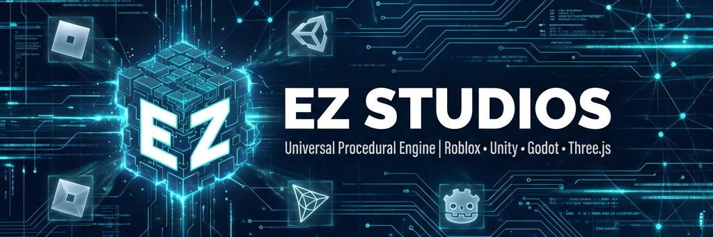
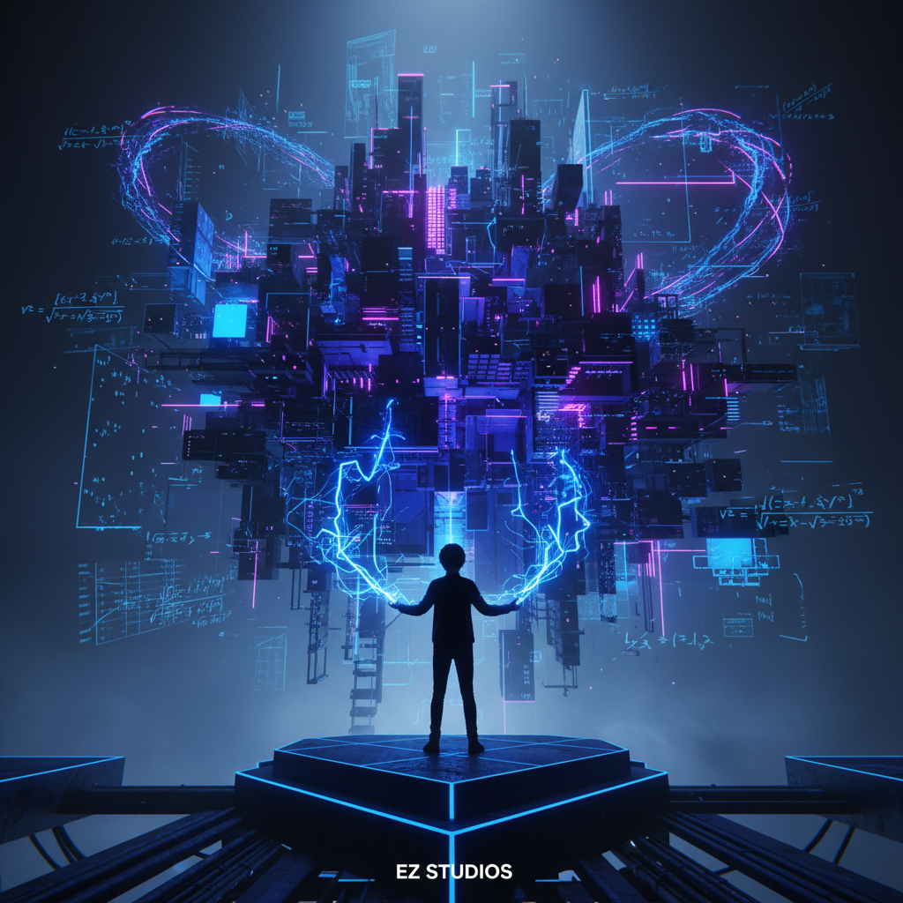
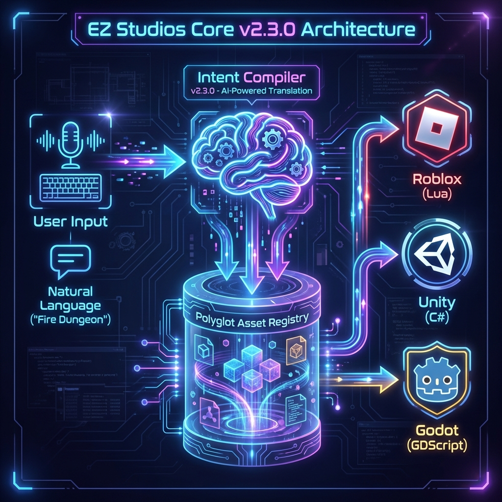
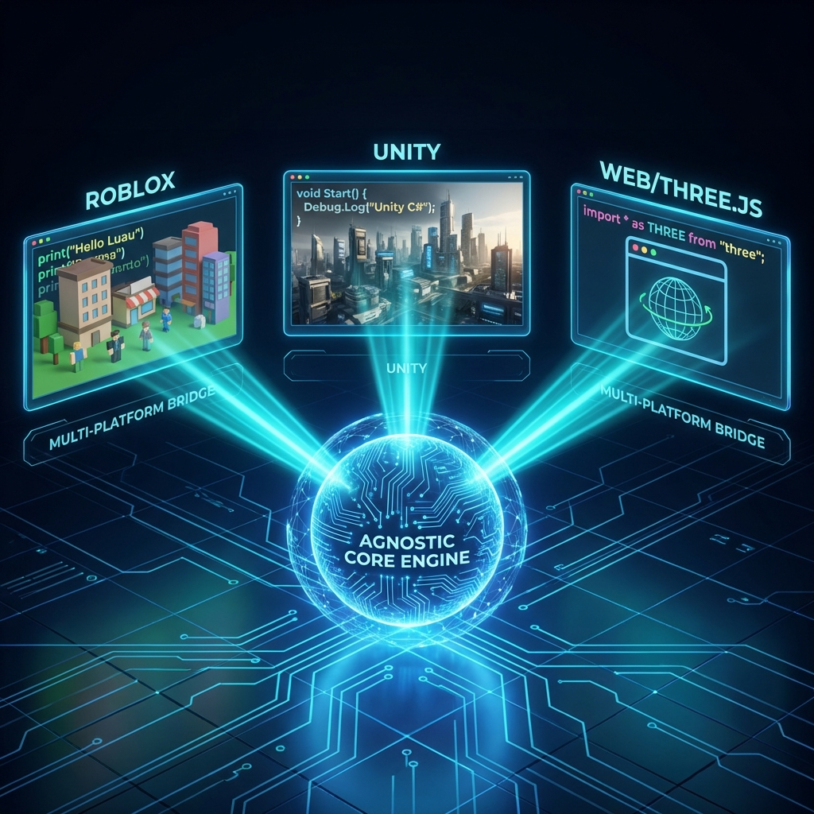

# 🌌 EZ Studios: Core Engine v2.0
> **Entropia Zero Protocol** | Transforming the Next Generation of Consumers into **Quantum Architects**.



[**Read in Portuguese / Leia em Português**](#%EF%B8%8F-ez-studios-core-engine-v20-pt-br)

---

## 💎 The Vision: From Player to Creator
**EZ Studios** is more than a map engine; it is the materialization of the **Entropia Zero Protocol**. Designed to democratize high-complexity game development, it allows students and creators to generate mathematically perfect worlds, characters, and procedural items through a natural language of intent.



EZ Studios is more than a game engine; it is an **Agnostic Procedural Intelligence Hub**. Our core technology, now evolving into a **Cloud-First Generative AI SaaS**, abstracts complex mathematical structures (AC-3, $D_4$ Groups) into a seamless "Intent-to-Asset" pipeline. By decentralizing generation and centralizing intelligence in the cloud, we ensure maximum IP protection and infinite scalability for the next generation of UGC.

A EZ Studios é mais do que um motor de jogo; é um **Hub de Inteligência Procedural Agnóstica**. Nossa tecnologia principal, agora evoluindo para um **SaaS de IA Generativa Cloud-First**, abstrai estruturas matemáticas complexas (AC-3, Grupos $D_4$) em um pipeline contínuo de "Intenção para Ativo". Ao descentralizar a geração e centralizar a inteligência na nuvem, garantimos a proteção máxima de IP e escalabilidade infinita para a próxima geração de UGC.

---

## 🛠️ Agnostic Architecture: The Multi-Platform Bridge
Built to be universal, the **EZ Studios Core** operates on an agnostic **IR (Intermediate Representation)**, exporting native code to multiple engines (Roblox, Unity, Godot, Web).

### v2.3.0 Architecture: The Brain & The Body
The new **Intent Compiler** (Brain) parses natural language into structural rules, while the **Polyglot Asset Registry** (Body) selects the correct native behavior for the target engine.



*(Previously: The Static Bridge)*


---

## 🏰 The Strategic Moat / O Fosso Estratégico

### 1. Intellectual Property (Black Box Cloud Core)
Unlike local software, our **Agnostic Core** is hosted in a secure cloud environment. This "Black Box" architecture prevents reverse engineering and ensures that our proprietary algorithms (Intent Compiler) remain a protected corporate asset.

### 2. Neural Procedural Networks (ML-First)
We are integrating Machine Learning to predict user architectural intent. This layer of "Predictive Math" reduces computational cost and allows for realistic style-transfer across different engine aesthetics (Quantum, Realistic, etc.).

### 3. High-Fidelity Rigor (AC-3 & D4)
The engine utilizes the **Arc-Consistency (AC-3)** algorithm and **Symmetry Groups ($D_4$)** to ensure 100% stable world generation. No "broken seeds" — only pure mathematical perfection.

### 4. Minor Protection & ESG (Safety Engine)
Fully compliant with **LGPD** and **COPPA**, our engine includes a native "Safety Layer" designed specifically for minor developers in the global south, providing a secure and educational ecosystem.

---

## 📈 Investor Relations (M&A Ready)
For Corporate Development teams and VCs, the EZ Core offers a 120x pedagogical density advantage with a proven **LTV:CAC of 39:1**.

- **Strategic Deck**: [Investor Pitch (PEG Framework)](./docs/business/INVESTOR_PITCH.md)
- **Equity & Growth**: [Revised Business Plan](./docs/business/complete_business_plan.md)
- **Economic Intelligence**: [Roblox Ecosystem Analysis](./docs/business/market_intelligence.md)

---

## 🚀 Quick Start

### Installation
```bash
git clone https://github.com/SH1W4/ez-studios-core.git
cd ez-studios-core
pnpm install
```

### CLI Generation (3D Multi-Layer)
```bash
pnpm tsx src/typescript/tests/bsp3d.test.ts
```

---

## 📊 Elite Metrics
- **Performance**: Collapse of 4,096 tiles in <500ms.
- **Fidelity**: 100% algebraic consistency via **AC-3** validation.
- **Impact**: 120x more pedagogical density than traditional courses.

---

## 📚 Documentation & Governance
| Category | Main Document |
|-----------|--------------------|
| 🔬 **Science** | [Mathematical Formalization](./docs/technical/mathematical_formalization.md) |
| 🛡️ **Security** | [Information Security Policy](./docs/legal/information_security_policy.md) |
| ⚖️ **Legal** | [Patent Application](./docs/legal/patent_application_intent_compiler.md) |
| 🏗️ **Framework** | [Holistic Generation](./docs/technical/holistic_generation_framework.md) |

---
---

# ⚔️ EZ Studios: Core Engine v2.0 (PT-BR)
> **Protocolo Entropia Zero** | Transformando a próxima geração de consumidores em **Arquitetos Quânticos**.

## 💎 A Visão: De Jogador a Criador
O **EZ Studios** é a materialização do **Protocolo Entropia Zero**. Projetado para democratizar o desenvolvimento de jogos de alta complexidade, ele permite a geração de mundos, personagens e itens procedurais matematicamente perfeitos via linguagem natural.

### 🧠 Geração Holística (PEG)
- **World Engine**: Divisão volumétrica 3D e colapso de incerteza (WFC).
- **Actor Factory**: Anatomia e IA procedurais.
- **Item Algebra**: Balanceamento de atributos e raridade automática.

---

## 🛠️ Arquitetura Agnóstica
O núcleo matemático reside em uma **IR (Intermediate Representation)** agnóstica, exportando código nativo para múltiplas engines (Roblox, Unity, Godot, Web).

---

## 🔒 O "Moat" Estratégico
1. **Compilador Patenteado**: Tecnologia de ponte proprietária que resolve a fricção de criação.
2. **Rigor Científico ($D_4$ & AC-3)**: Estabilidade absoluta em tempo de execução.
3. **ESG & Proteção**: Compliance nativo com LGPD/COPPA para menores desenvolvedores.

---

## 📈 Relação com Investidores
- **Strategic Deck**: [Investor Pitch (PEG Framework)](./docs/business/INVESTOR_PITCH.md)
- **Crescimento**: [Business Plan](./docs/business/complete_business_plan.md)
- **Inteligência**: [Market Intelligence](./docs/business/market_intelligence.md)

---

**EZ Studios** — *Consolidating order, maximizing enterprise value.*
