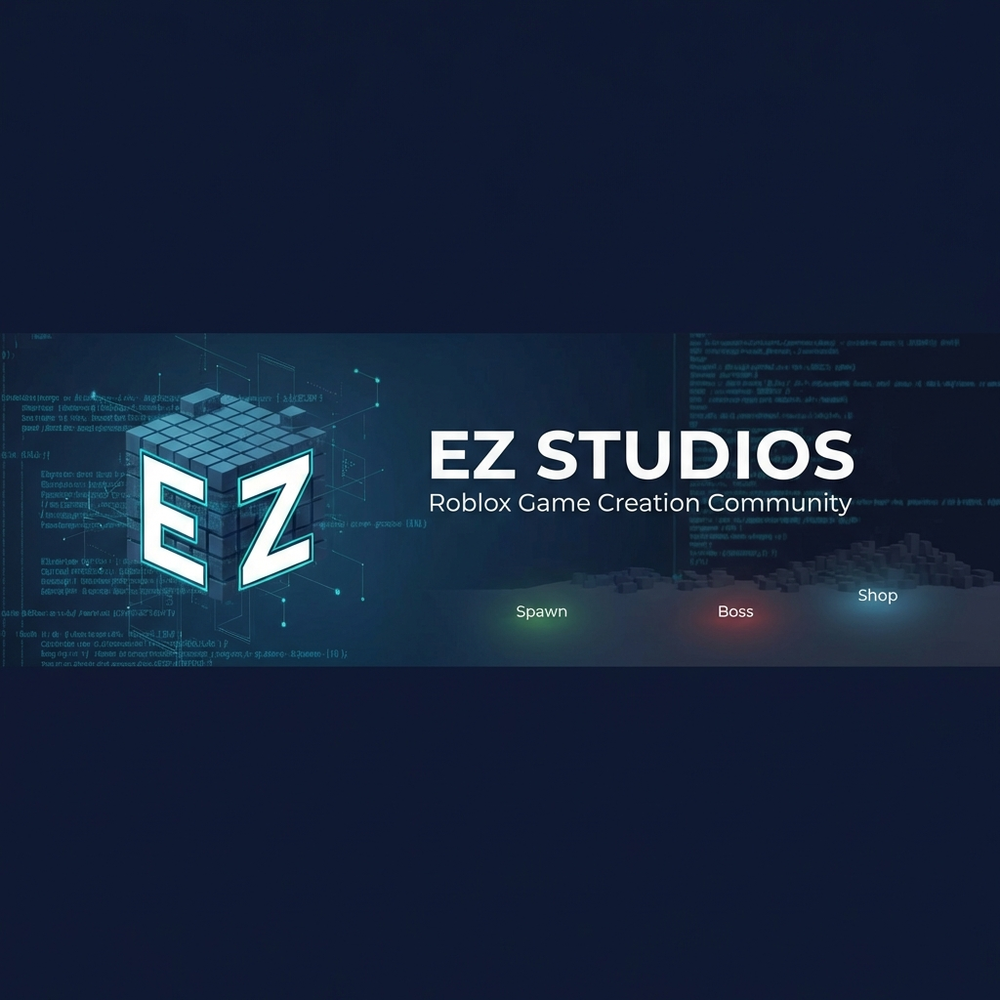

# 🌌 EZ Studios: Core Engine v2.0
> **Entropia Zero Protocol** | Transforming the Next Generation of Consumers into **Quantum Architects**.



---

## 💎 A Visão: De Jogador a Criador
O **EZ Studios** não é apenas um motor de mapas; é a materialização do **Protocolo Entropia Zero**. Projetado para democratizar o desenvolvimento de jogos de alta complexidade, ele permite que estudantes e criadores gerem mundos, personagens e itens procedurais matematicamente perfeitos através de uma linguagem natural de intenções.


### 🧠 Geração Holística (PEG)
Nosso diferencial reside na **Procedural Experience Generation**. O motor gera ecossistemas completos sob o mesmo rigor matemático:
- **World Engine**: Divisão volumétrica 3D via BSP e colapso de incerteza via WFC.
- **Actor Factory**: Anatomia e IA procedurais.
- **Item Algebra**: Balanceamento de atributos e raridade automática.


---

## 🛠️ Arquitetura Agnóstica: A Ponte Multi-Plataforma
Diferente de ferramentas presas a uma única plataforma, o **EZ Studios Core** foi construído para ser universal. O núcleo matemático reside em um **IR (Intermediate Representation)** agnóstico, exportando código nativo para múltiplas engines.


---

## 🛡️ Safe Zone: Proteção e Pedagogia
Integrado ao **Minor Protection Framework**, oferecemos um ambiente seguro para jovens desenvolvedores monetizarem seu talento com supervisão parental total.


---

## 🚀 Início Rápido

### Instalação
```bash
git clone https://github.com/SH1W4/ez-studios-core.git
cd ez-studios-core
pnpm install
```

### Gerando via CLI (3D Multi-Layer)
```bash
pnpm tsx src/typescript/tests/bsp3d.test.ts
```

---

## 📊 Métricas de Elite
- **Performance**: Colapso de 4.096 tiles em <500ms.
- **Fidelidade**: 100% de consistência algébrica via validação **AC-3**.
- **Impacto**: 120x mais densidade pedagógica que cursos tradicionais.

---

## 📚 Ecossistema de Documentação
O projeto conta com uma base de conhecimento de nível PhD.

| Categoria | Documento Principal |
|-----------|--------------------|
| 📈 **Estratégia** | [Market Intelligence](./docs/business/market_intelligence.md) |
| 🧪 **Mecânica** | [Mathematical Formalization](./docs/technical/mathematical_formalization.md) |
| ⚖️ **Legal** | [Patent Application](./docs/legal/patent_application_intent_compiler.md) |
| 🏗️ **Framework** | [Holistic Generation](./docs/technical/holistic_generation_framework.md) |

---
**EZ Studios** — *Criando ordens onde só havia entropia.*
