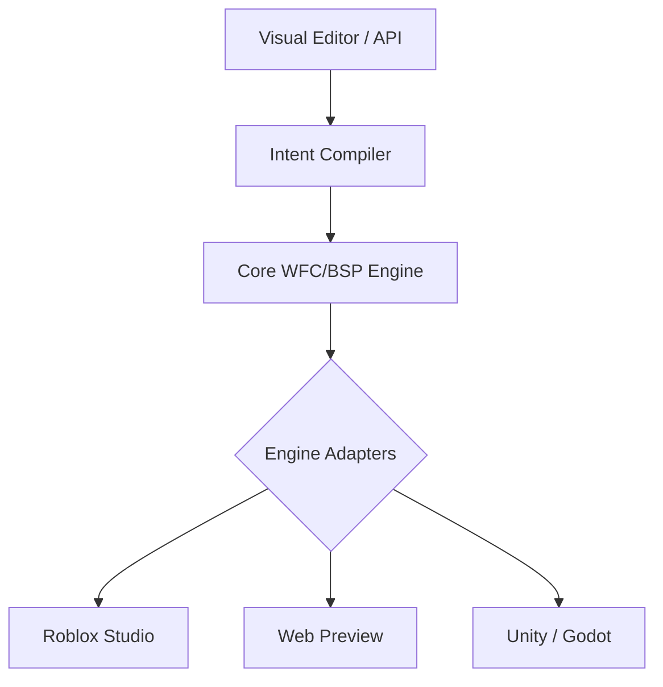

# 🌌 EZ Studios: Core Engine
> **Entropia Zero Protocol** | Procedural Content Generation for the Next Generation of Developers.


---

## 💎 A Visão
**EZ Studios** não é apenas um motor de mapas; é a materialização do **Protocolo Entropia Zero**. Projetado para democratizar o desenvolvimento de jogos de alta complexidade, ele permite que estudantes e criadores gerem mundos procedurais matematicamente perfeitos através de uma linguagem natural de intenções.

### 🧠 O "Coração" (Intent Compiler)
Nosso diferencial reside na camada de abstração. O desenvolvedor define a *intenção* (ex: "Uma masmorra labiríntica com alta densidade de recursos"), e o nosso motor quântico traduz isso em regras de **Wave Function Collapse (WFC)** e **Binary Space Partitioning (BSP)**.

---

## 🛠️ Arquitetura Agnóstica
Diferente de ferramentas presas a uma única plataforma, o **EZ Studios Core** foi construído para ser universal.



---

## 🚀 Início Rápido

### Instalação
```bash
git clone https://github.com/SH1W4/ez-studios-core.git
cd ez-studios-core
pnpm install
```

### Gerando via CLI
```bash
pnpm tsx examples/generate-map.ts
```

---

## 📚 Ecossistema de Documentação
O projeto conta com mais de 240 documentos técnicos, jurídicos e acadêmicos.

| Categoria | Documento Principal |
|-----------|--------------------|
| 📈 **Estratégia** | [Executive Summary](./docs/EXECUTIVE_SUMMARY.md) |
| 🧪 **Ciência** | [Mathematical Formalization](./docs/technical/mathematical_formalization.md) |
| ⚖️ **Legal** | [Patent Application](./docs/legal/patent_application_intent_compiler.md) |
| 🏢 **Negócios** | [Business Plan](./docs/business/complete_business_plan.md) |
| 🏗️ **Estrutura** | [Project Structure](./STRUCTURE.md) |

---

## 📊 Métricas de Elite
- **Performance**: Colapso de 4.096 tiles em <500ms.
- **Eficiência**: Otimização de batching Luau em 100x vs. instanciamento manual.
- **Segurança**: Framework de proteção a menores integrado nativamente.

---

## 🤝 Contribuição
Queremos parceiros que acreditem no poder do procedural. Veja o nosso [CONTRIBUTING.md](./CONTRIBUTING.md).

## 📄 Licença
Distribuído sob a licença MIT. Veja `LICENSE` para mais informações.

---
**EZ Studios** — *Criando ordens onde só havia entropia.*
