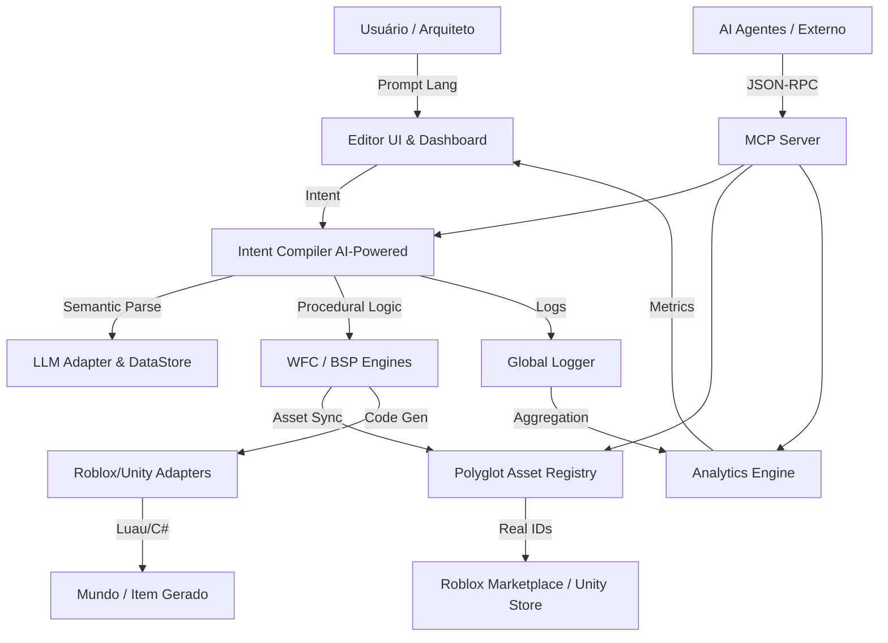

# EZ Studios Master Blueprint & Handoff Map (v2.4.0) 🗺️🛡️

Este documento serve como a "Ponte de Consciência" entre máquinas. Ele resume a arquitetura, o estado atual e a visão técnica do EZ Studios para que o desenvolvimento no **v15** continue sem atrito.

## 🎓 Missão Principal: EdTech para Jovens Arquitetos (8-16 anos)
Nunca se esqueça: o EZ Studios não é apenas para gerar código; é uma ferramenta pedagógica de vanguarda. 
- **Objetivo**: Capacitar crianças e adolescentes a dominarem a criação de mundos, IA e economia digital.
- **DNA**: Design intuitivo, segurança (Compliance) e educação financeira via ROI de criação.

---

## 🏗️ Mapa da Arquitetura Holística

---

## 🚀 Estado Atual: Consolidação v2.4.0
Acabamos de completar um ciclo massivo de evolução:

1.  **Cérebro (Brain)**: O [Intent Compiler](file:///Users/jx/Desktop/ROBLOX_$$$/src/typescript/compiler/intentCompiler.ts) agora é assíncrono e integrado ao [LLMAdapter](file:///Users/jx/Desktop/ROBLOX_$$$/src/typescript/compiler/llmAdapter.ts). Ele coleta dados de treino via [IntentDataStore](file:///Users/jx/Desktop/ROBLOX_$$$/src/typescript/data/intentDataStore.ts).
2.  **Corpo (Body)**: Criamos o [Asset Registry](file:///Users/jx/Desktop/ROBLOX_$$$/src/typescript/data/assetRegistry.ts) poliglota que sincroniza assets reais do Roblox (`rbxassetid`).
3.  **Córtex (Analytics)**: O [Analytics Engine](file:///Users/jx/Desktop/ROBLOX_$$$/src/typescript/infra/logging/analyticsEngine.ts) agora rastreia **múltiplas fontes de receita** (Marketplace, Comissões, Premium) e calcula o ROI por hora.
4.  **Interface (UI)**: O [Dashboard](file:///Users/jx/Desktop/ROBLOX_$$$/src/typescript/ui/Dashboard.tsx) possui um **Revenue Hub** e o [Editor](file:///Users/jx/Desktop/ROBLOX_$$$/src/typescript/ui/Editor.tsx) possui feedback RLHF.
5.  **Ponte Agentica (Connectivity)**: O [MCP Server](file:///Users/jx/Desktop/ROBLOX_$$$/src/typescript/mcp/server.ts) está operacional, permitindo que IAs controlem a engine.

---

## 📂 Diretório de Poder (Arquivos Chave)

| Componente | Caminho | Função |
|------------|---------|--------|
| **AI Server** | `src/typescript/mcp/server.ts` | Porta de entrada para IAs Agentes. |
| **IA Compiler** | `src/typescript/compiler/intentCompiler.ts` | Coração da tradução Prompt -> Código. |
| **Analytics** | `src/typescript/infra/logging/analyticsEngine.ts` | Calculadora de XP, ROI e Receitas. |
| **Registry** | `src/typescript/data/assetRegistry.ts` | Catálogo de assets profissionais e comportamentos. |
| **Roblox** | `src/typescript/adapters/robloxAdapter.ts` | Gerador final de código Luau híbrido. |

---

## 🛠️ Tech Stack Atual
- **Linguagens**: TypeScript (Core), Luau (Roblox Output), JSONL (Dataset).
- **Frontend**: React 18, Vite, Framer Motion (Animações Premium), Lucide React.
- **Protocolos**: MCP (Model Context Protocol), Protocolo Entropia Zero (Design).
- **Gestão**: Git (Sincronização main branch), pnpm (Pacotes).

---

## ⏩ Próximos Passos (v15 e além)
1.  **Expansão Unity**: Implementar o `UnityAdapter` real seguindo o padrão do `RobloxAdapter`.
2.  **Fine-Tuning**: Usar o JSONL do `IntentDataStore` para treinar um modelo Gemma/Llama focado no EZ Studios.
3.  **App Mobile**: Começar o planejamento do app para tablets (Dashboard Parental).

---

## 📝 Instruções para a IA no v15
> *"Olá! Você está assumindo o projeto EZ Studios. Lembre-se que nosso propósito é **educacional (8-16 anos)**. Cada ferramenta MCP, cada build de Analytics e cada prompt compilado deve servir para empoderar o jovem Arquiteto. O sistema está em um estado v2.4.0. Siga o `HANDOFF_MAP.md` e o `task.md`."* 🛡️🎓🤖

**Finalizada a sessão por Antigravity.** 🛡️🌍💎
