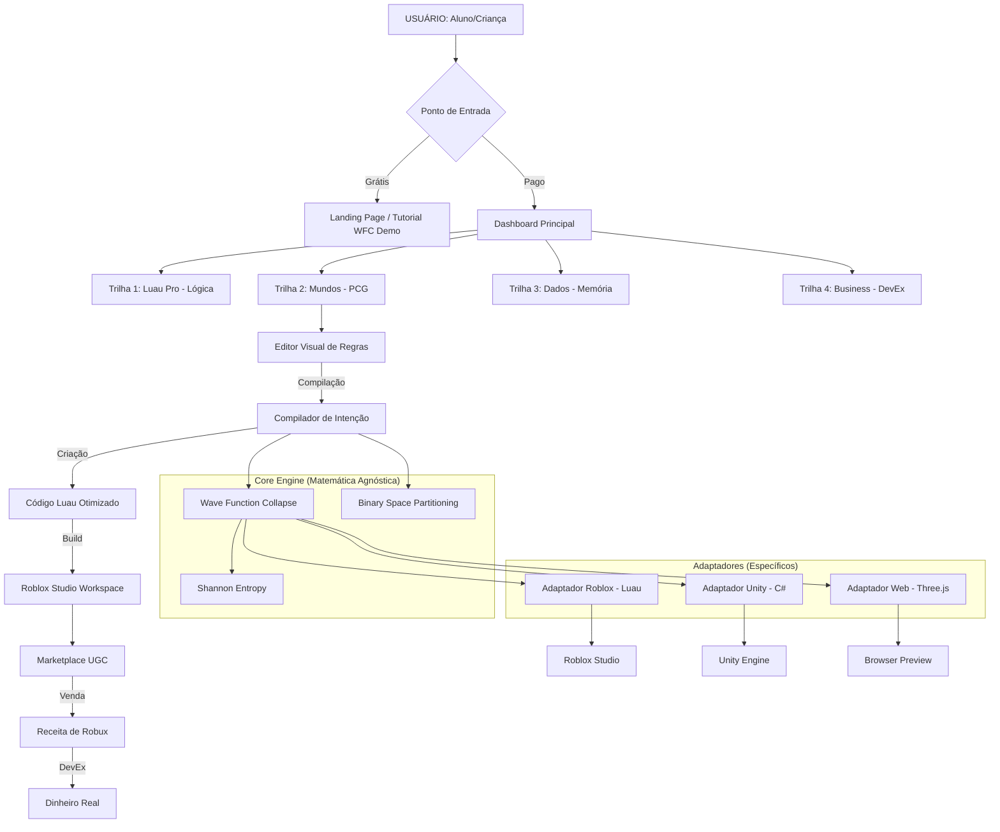

# MAPA DE SESSÕES E ROADMAP DO SISTEMA

**PROJETO**: EZ Studios - Protocolo Entropia Zero  
**OBJETIVO**: Mapear o fluxo de experiência do usuário (UX) e o amadurecimento técnico do sistema.

---

## 🗺️ MAPA MENTAL DO ECOSSISTEMA

---

## 📅 ROADMAP DE SESSÕES (JORNADA DO ALUNO)

### Sessão 0: "O Colapso Inicial" (Minuto 0-10)
- **Ação**: Criança escolhe um tema e vê o mundo gerado em 3 segundos.
- **Hook**: "Como esse mundo foi criado? Quer aprender a controlar essa magia?"

### Sessão 1: "O Arquiteto de Regras" (Minuto 10-60)
- **Foco**: Editor Visual (No-code).
- **Tarefa**: Criar um pequeno vilarejo definindo onde "estrada" e "grama" podem se encontrar.
- **Resultado**: Primeiro mapa exportado para Roblox.

### Sessão 2: "Sintonizando a Entropia" (Semana 1)
- **Foco**: Conceitos de WFC e Pesos.
- **Tarefa**: Ajustar a probabilidade de surgir "lagos" ou "castelos".
- **Aprendizado**: Variáveis e pesos algébricos.

### Sessão 3: "Dungeons e Partições" (Semana 2)
- **Foco**: Algoritmo BSP.
- **Tarefa**: Criar uma arena de combate dividida em salas equilibradas.
- **Aprendizado**: Geometria e divisão recursiva de espaço.

### Sessão 4: "Otimização Hacker" (Semana 3)
- **Foco**: Luau Opcodes.
- **Tarefa**: Usar `GETIMPORT` para fazer o mapa construir 2x mais rápido.
- **Aprendizado**: Performance de baixo nível de forma lúdica.

---

## 📈 ROADMAP TÉCNICO (ENTREGA SISTÊMICA)

| Fase | Título | Milestone Técnico | Foco de Negócio |
|------|--------|-------------------|-----------------|
| **V1** | "Spark" | Motor WFC real ligado ao Editor React | Validação do "Momento Uau" |
| **V2** | "Structure" | BSP Funcional + Sistema de Logs de Aluno | Retenção Educacional |
| **V3** | "Economy" | Marketplace Alpha + Exportação Automática | Ciclo de Monetização |
| **V4** | "Scale" | Suporte a 10.000+ partes via Chunking | Expansão B2B (Escolas) |

---

## ⚡ FLUXO DE "LIGAÇÃO DOS FIOS" (PRÓXIMOS PASSOS)

1. **INPUT**: `Editor.tsx` (Lista de Tiles e Regras)
2. **MIDDLE**: `intentCompiler.ts` (Recebe JSON do Editor e executa cálculos)
3. **CALC**: `wfc.ts` (Gera a matriz de tiles final)
4. **OUTPUT**: `educationalApi.ts` (Retorna o Código Luau para o aluno baixar)
