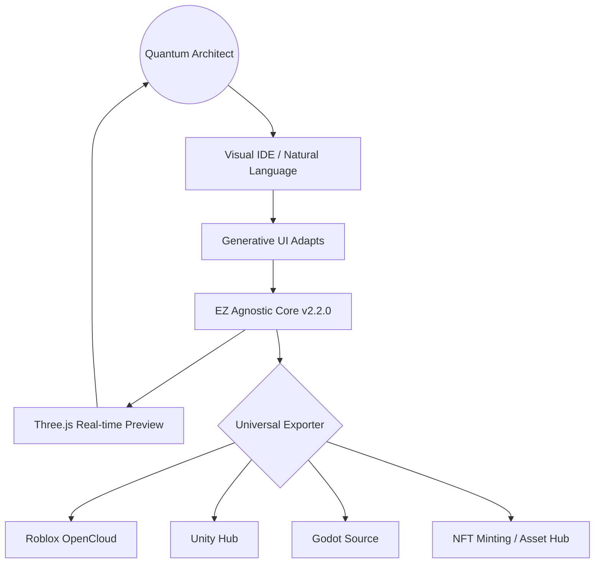

# 🌐 EZ Studios: Universal Web Hub Architecture (SaaS)

Expanding from a local engine to a globally accessible **Generative UI (GenUI)** platform for Quantum Architects.

## 1. System Vision: The "One-Click" Procedural Cloud
The Web Hub is the central nervous system of the EZ Ecosystem. It abstracts the complexity of the WFC/BSP engines behind a modern, adaptive web interface.

### Key Pillars:
- **Generative UI (GenUI)**: Interfaces that recompose themselves based on the user's intent (e.g., switching from "Dungeon Builder" to "NPC Designer" on the fly).
- **Agnostic API**: A unified Node.js/TypeScript backend running the Core Engine v2.2.0.
- **Visual Viewport**: Real-time 3D rendering via Three.js with full parity to destination engines.
- **The "Bridge" Hub**: Direct integration with Roblox OpenCloud, GitHub (for Unity/Godot), and WebGL exports.

## 2. Technical Stack
| Layer | Technology | Role |
|-------|------------|------|
| **Frontend** | Next.js 15 + Three.js | High-fidelity UI & 3D Preview |
| **Backend** | Node.js (Agnostic Core) | Intent Compiling & Procedural Logic |
| **Logic Engine** | WFC + AC-3 + D4 Groups | Mathematical Foundation |
| **Database** | PostgreSQL + Redis | User Assets, NFT Seeds, & Real-time Colab |
| **Security** | Minor Protection Framework | ESG/Compliance Layer (LGPD/COPPA) |

## 3. High-Level Flow (Mermaid)

## 4. Strategic SaaS Revenue Streams
1. **The Architect Tier (SaaS)**: Monthly subscription for advanced procedural templates and storage.
2. **API Licensing (B2B)**: Allowing third-party games to use the EZ Core for in-game infinite content.
3. **Marketplace (Minor Protective)**: Safe percentage fee on asset trades between young developers.

---
**EZ Web Hub** — *The future of game dev is browser-native and intent-driven.*
