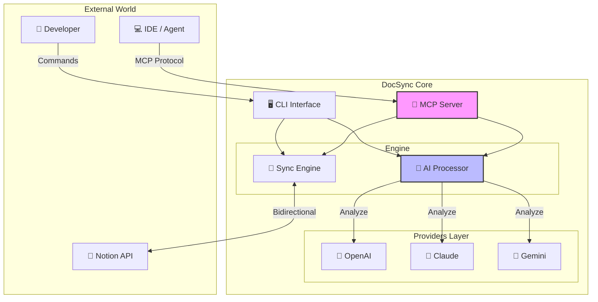

# 🏗️ DocSync Architecture

```mermaid
graph TD
    subgraph "External World"
        User[👤 Developer]
        IDE[💻 IDE / Agent]
        Notion[📝 Notion API]
    end

    subgraph "DocSync Core"
        CLI[🖥️ CLI Interface]
        MCP[🔌 MCP Server]
        
        subgraph "Engine"
            Sync[🔄 Sync Engine]
            AI[🧠 AI Processor]
        end
        
        subgraph "Providers Layer"
            OpenAI[🤖 OpenAI]
            Claude[🤖 Claude]
            Gemini[🤖 Gemini]
        end
    end

    %% Flows
    User -->|Commands| CLI
    IDE -->|MCP Protocol| MCP
    
    CLI --> Sync
    CLI --> AI
    MCP --> Sync
    MCP --> AI
    
    Sync <-->|Bidirectional| Notion
    
    AI -->|Analyze| OpenAI
    AI -->|Analyze| Claude
    AI -->|Analyze| Gemini
    
    style MCP fill:#f9f,stroke:#333,stroke-width:2px
    style AI fill:#bbf,stroke:#333,stroke-width:2px
```
