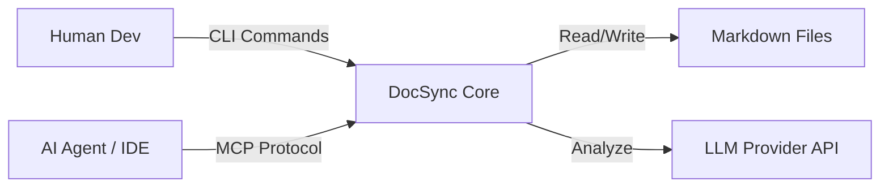

# DocSync: Agentic Documentation Infrastructure

<div align="center">


[](https://github.com/SH1W4/docsync/actions)
[](https://badge.fury.io/py/docsync)
[](https://opensource.org/licenses/MIT)
[](https://modelcontextprotocol.io)

**Turn static documentation into live, agent-readable knowledge.**
*Synchronize, Validate, and Enforce documentation quality using LLMs.*

[🇧🇷 Português](./docs/pt-br/README.md) | **🇺🇸 English**

</div>

---

## ⚡ The Problem
In modern software development, **documentation rots faster than code**. 
Developers hate writing it, and AI Agents hallucinate when reading outdated files.

## 🛡️ The Solution: DocSync
**DocSync** is not just a linter. It is an **Agentic Infrastructure Tool** that treats your documentation as a living database. It sits between your codebase and your LLMs, ensuring that every Markdown file is accurate, up-to-date, and semantically structured for retrieval.

> "Don't let your Agent read garbage. Feed it DocSync."

---

## 🔥 Key Capabilities

### 🔌 1. Native MCP Server (Model Context Protocol)
DocSync exposes your entire documentation knowledge base as a structured **MCP Server**.
*   **For Claude/Cursor:** Connect DocSync to your assistant. It can now "read", "search", and "patch" your docs autonomously.
*   **No API Gluing:** It just works with any MCP-compliant client.

### 🧠 2. AI-Driven Semantic Validation
Forget regex. DocSync uses **LLMs (OpenAI, Anthropic, Gemini)** to understand the *content* of your docs.
*   *Does this README match what `main.py` actually does?*
*   *Is the tone consistent across all 50 files?*
*   *Are these installation steps actually executable?*

### 🔄 3. Multi-Provider Intelligence
Agnostic by design. Swap brains on the fly:
*   `--provider openai` (GPT-4o for deep logic)
*   `--provider anthropic` (Claude 3.5 Sonnet for huge context windows)
*   `--provider gemini` (Gemini Pro for speed)

---

## 🚀 Quick Start (Production Ready)

### Installation
```bash
pip install docsync
```

### 1-Click Optimization
Improve your README instantly using your preferred LLM:
```bash
export OPENAI_API_KEY="sk-..."
docsync improve README.md --instruction "Make it sound enterprise-ready"
```

### Launch MCP Agent
Turn your folder into a knowledge server:
```bash
### Launch MCP Agent
Turn your folder into a knowledge server:
```bash
docsync serve --port 8000
```

### 🛠️ Automation (Taskfile)
We use `go-task` to standardize development commands:
```bash
task install   # Install dependencies
task test      # Run tests
task lint      # Check code quality
task clean     # Remove cache
task serve     # Start MCP Server
```

---

## 🏗️ Architecture & Design

DocSync is built with **Resilience** and **Extensibility** in mind.

*   **Core:** Python 3.9+ with strict typing (MyPy).
*   **Interface:** Rich CLI for humans, JSON-RPC for Agents.
*   **Pattern:** Adapter Pattern for LLMs (easy to add Llama 3 or Mistral).



---

## 💼 Enterprise Use Cases

| Persona | Benefit |
| :--- | :--- |
| **CTOs** | Ensure compliance and documentation standards across 100+ repos. |
| **DevOps** | Auto-generate changelogs and deployment guides during CI/CD. |
| **Solo Devs** | Have a "Documentation Co-pilot" that writes the boring stuff for you. |

---

## 🤝 Contributing

We are building the standard for **AI-Augmented Documentation**. 
Contributions are welcome for:
*   New MCP Tools
*   Additional LLM Providers (Ollama, Groq)
*   Integrations (Notion, Confluence)

## 🛣️ Future Roadmap
- [ ] **Performance Core:** Research migration to **Go (Golang)** for instant CLI execution (< 10ms).
- [ ] **Cloud Sync:** Direct integration with Confluence/Notion APIs.

See [CONTRIBUTING.md](./CONTRIBUTING.md) to join the swarm.

---

<div align="center">
    <b>Built by <a href="https://github.com/SH1W4">SH1W4</a> // Symbeon Labs</b>
</div>
