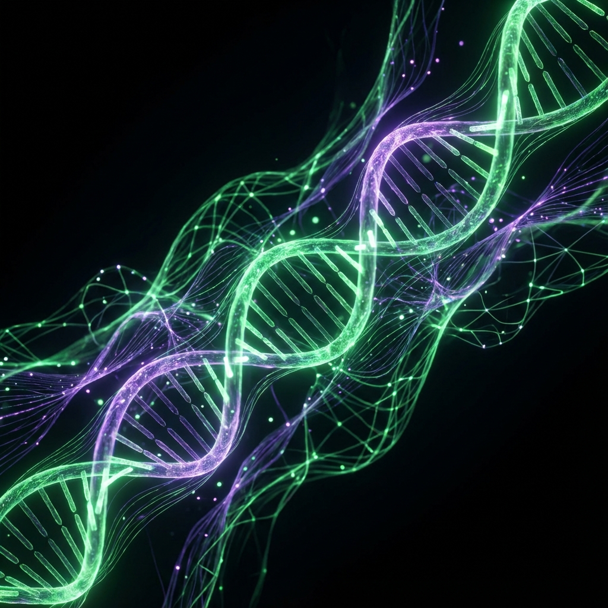

<!-- 
    THEME: ORGANIC_INTELLIGENCE (PROFESSIONAL)
    COLOR_PALETTE: #00ff41 (Bio-Green), #bd93f9 (Synth-Purple), #ffffff (Clean White)
    STYLE: Minimalist Biocybernetic
-->

    
      
    
     
    <h1>SH1W4</h1>
    <h3><code>Creative Technologist & AI Systems Architect</code></h3>
     
    

        <b>[ SYSTEMS: ACTIVE ]</b> &nbsp;|&nbsp; <b>[ COGNITION: AUGMENTED ]</b> &nbsp;|&nbsp; <b>[ FOCUS: EVOLUTIONARY ]</b>
    

     

---

### M I S S I O N _ P R O T O C O L

> "Desenvolvendo a próxima geração de infraestrutura digital onde **Código** e **Biomimética** convergem. Especialista em criar sistemas que não apenas processam dados, mas se adaptam e evoluem."

*   🔭 **Atualmente Sintonizado:** Orquestração de Agentes Autônomos & Ecossistemas MCP.
*   🧬 **DNA Tecnológico:** Python, Rust, AI/ML Engineering.
*   🤝 **Colaboração:** Aberto a parcerias em projetos de *Deep Tech* e IA Generativa.

---

### T E C H N O L O G I C A L _ G E N O M E

<table>
  <tr>
    <td align="center" width="25%"><b>CORE INTELLIGENCE</b></td>
    <td align="center" width="25%"><b>INFRASTRUCTURE & SHELL</b></td>
    <td align="center" width="25%"><b>DATA SYNAPSES</b></td>
    <td align="center" width="25%"><b>DEV OPS</b></td>
  </tr>
  <tr>
    <td align="center">
        
    </td>
    <td align="center">
        
    </td>
    <td align="center">
        
    </td>
     <td align="center">
        
    </td>
  </tr>
</table>

---

### S E L E C T E D _ W O R K S

| PROJECT | TYPE | DESCRIPTION | STATUS |
| :--- | :--- | :--- | :--- |
| **[🛡️ EditalShield](https://github.com/symbeon-labs/editalshield)** | `Security` | Framework de proteção de PI para editais de inovação utilizando IA. | 🟢 **Active** |
| **[🌐 VIREON Ecosystem](https://github.com/SH1W4/mcp-ecosystem)** | `Integration` | Coleção de servidores MCP para conectar ferramentas a Agentes de IA. | 🟣 **Evolving** |
| **[📚 DocSync](https://github.com/SH1W4/docsync)** | `Productivity` | Automação inteligente para gestão e sincronização de documentação. | 🔵 **Stable** |

---

### N E T W O R K _ U P L I N K

  <h3><code>ORGANISM_STATUS</code></h3>
  

   
  
  
  

 

